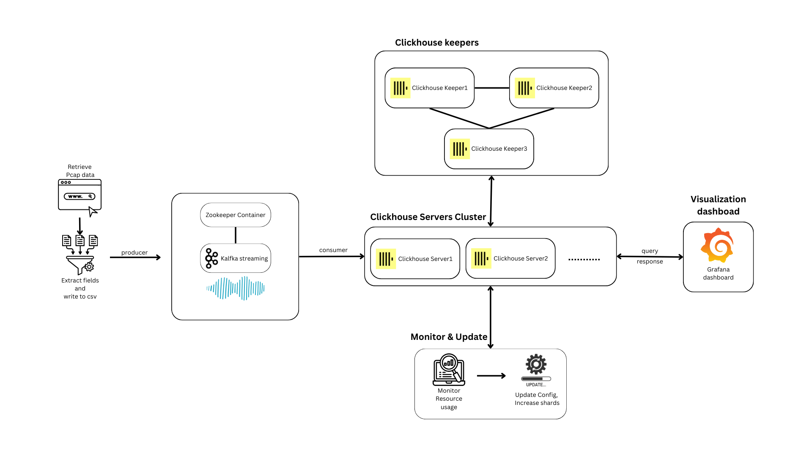

# Real-time analytics of Internet traffic flow data

## Download the dataset

- The full preprocessed dataset is hosted [here](https://tmp.knravish.me/512_proj/1M_sample_2023_10_01-2023_10_31.csv) - 1.4GB
- Place this file in the `preprocessing` directory
- For testing purposes, you can use the sample CSV that has 10k records from each day instead, change the bind path in the Compose file

## To run the project

- From the `scripts` directory:
  - Run `deploy.ps1 -M` for Windows
  - Run `deploy.sh -M` for Linux/macOS (add `-S` if sudo needed for docker)
  - See the `README` in `scripts` for more
- This sets up the whole stack

### Access the UI

- The Grafana web interface is located at `http://localhost:7602`
- Login:
  - Username: `thewebfarm`
  - Password: `mrafbeweht`
- Go to `Dashboards` > `Internet traffic capture analysis`

### To run the shard creation and scaling script

- From the `scripts` directory:
  - Install dependencies: `python3 -r ../clickhouse/update_config_scripts/requirements.txt`
  - Run `python3 ../clickhouse/update_config_scripts/update_trigger.py`
- This checks every 2 minutes and creates a new shard and two server nodes for it based on resource utilization

## Limitations

- For multi-node deployments using Docker Swarm, the manager node needs to be running on Linux (outside Docker Desktop i.e. standalone Docker installation) due to limitations in the Docker Swarm engine
